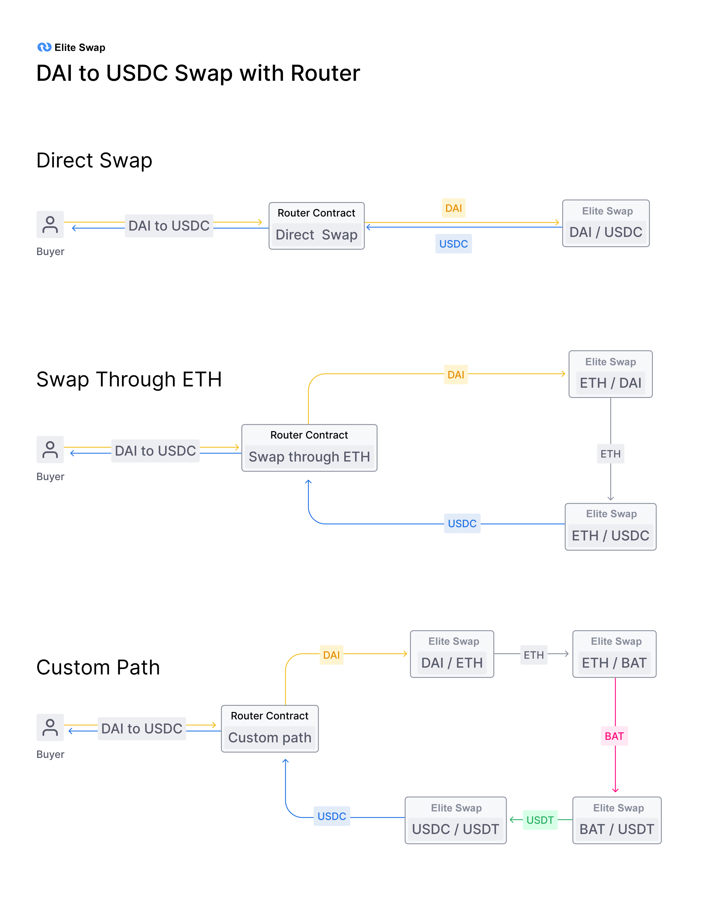
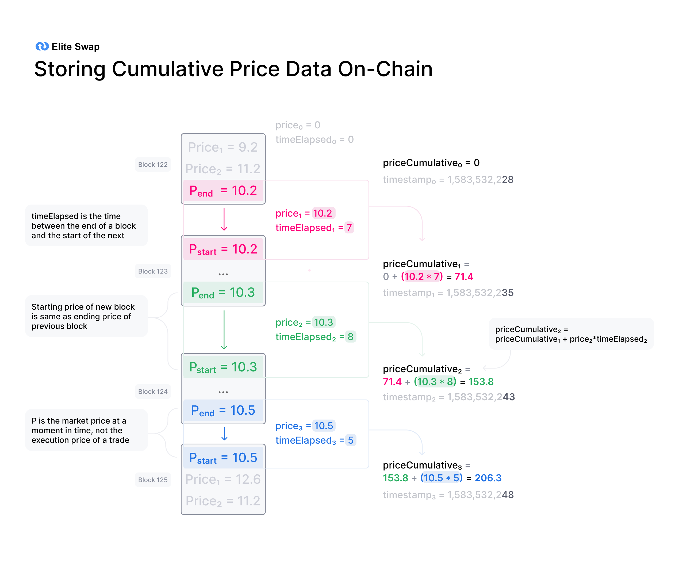
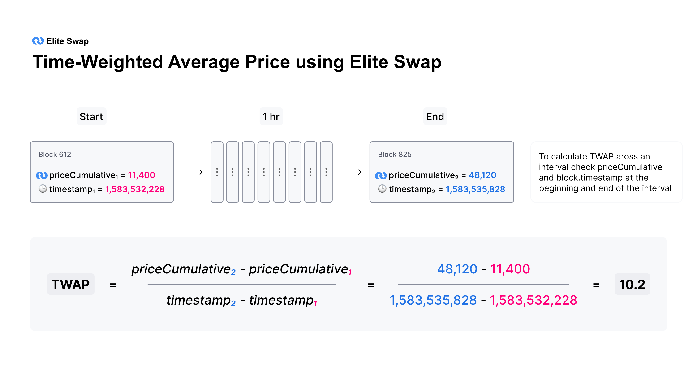
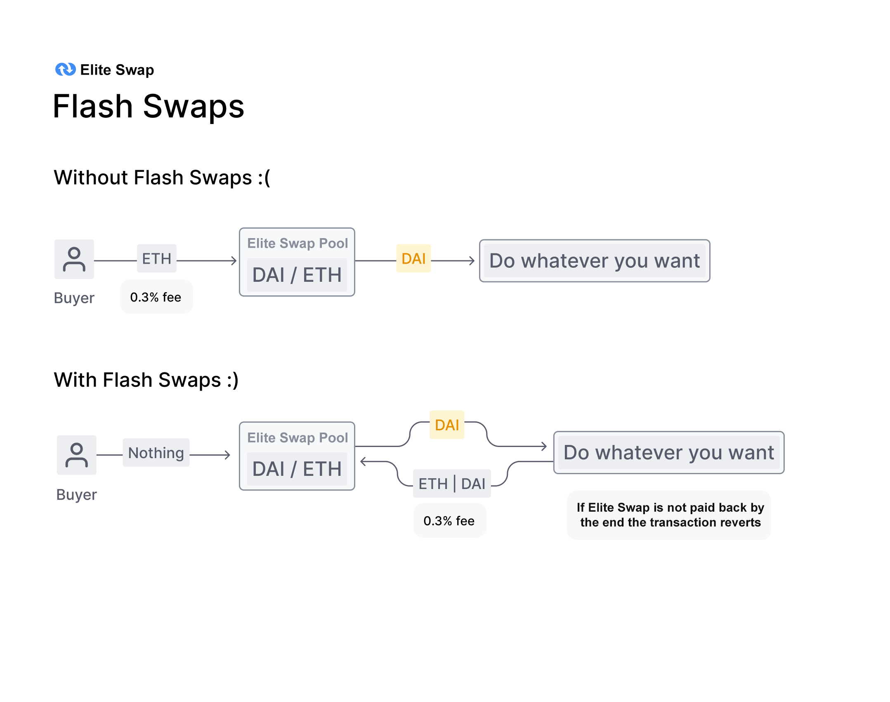

- [ERC20 / ERC20 Pairs](#erc20--erc20-pairs)
- [Price Oracles](#price-oracles)
- [Flash Swaps](#flash-swaps)
- [Core/Helper Architecture](#corehelper-architecture)
- [Technical Improvements](#technical-improvements)
- [Path to Sustainability](#path-to-sustainability)

For full details check out the:

- [Core smart contracts](https://github.com/EthereumEliteswap/eliteswap-v2-core/)
- [Periphery smart contracts](https://github.com/EthereumEliteswap/eliteswap-v2-periphery)

## ERC20 / ERC20 Pairs

In Elite Swap, **any ERC20 token can be pooled directly with any other ERC20 token**. Wrapped Ether (WETH) is used instead of native ETH in the core contracts, although end users can still use ETH through helper contracts.

The introduction of ERC20 token/ERC20 token pools in Elite Swap can be **useful for liquidity providers, who can maintain more diverse ERC20 token denominated positions**, without mandatory exposure to ETH. One example would be a DAI/USDC pair, which should theoretically have little volatility for liquidity providers, but is useful for trading.

Having direct ERC20/ERC20 pairs can also improve prices because routing through ETH for a swap between two other assets (say, DAI/USDC) involves paying fees and slippage on two separate pairs instead of one.

If two ERC20 tokens are not paired directly, and do not have a common pair between them, they can still be swapped as long as a path between them exists. Router contracts can be used to optimize between direct and multi-step swaps.

We still anticipate ETH pairs being very popular, but expect to see growth in other types of pairs over time.

## Price Oracles

**Elite Swap implements functionality that enables highly decentralized and manipulation-resistant on-chain price feeds.** This is achieved by measuring prices when they are expensive to manipulate, and cleverly accumulating historical data. This allows external smart contracts to create gas-efficient, time-weighted averages of Elite Swap prices across **any** time interval.

**On-chain price feeds are a critical component for many decentralized financial applications** including those similar to derivatives, lending, margin trading, prediction markets and more.

Elite Swap includes a number of improvements for price feeds built on top of it. First, every pair measures (but does not store) the market price at the beginning of each block, before any trades take place. This price is expensive to manipulate because it was set by the last transaction in a previous block.

**To set the measured price to one that is out of sync with the global market price, an attacker has to make a bad trade at the end of a previous block** , typically with no guarantee that they will be able to arbitrage it back in the next block. Attackers will lose money to arbitrageurs, unless they can "selfishly" mine two blocks in a row. This type of attack presents a number of challenges and [has not been observed to date](https://arxiv.org/abs/1912.01798).

This alone is not enough. If significant value settles based on the price resulting from this mechanism, then the profit of an attack likely can outweigh the loss.

Instead, Elite Swap adds this end-of-block price to a single cumulative-price variable in the core contract weighted by the amount of time this price existed. **This variable represents a sum of the Elite Swap price for every second in the entire history of the contract.**

This variable can be used by external contracts to track accurate time-weighted average prices (TWAPs) across any time interval.

This is done by reading the cumulative price from an ERC20 token pair at the beginning and at the end of the interval. The difference in this cumulative price can then be divided by the length of the interval to create a TWAP for that period.

TWAPs can be used directly or as the basis for moving averages (EMAs and SMAs) as needed.

A few notes:

- For a 10-minute TWAP, sample once every 10 minutes. For a 1-week TWAP, sample once every week.
- For a simple TWAP, the cost of manipulation increases (approx. linear) with liquidity on Elite Swap, as well as (approx. linear) with the length of time over which you average.
- Cost of an attack is relatively simple to estimate. Moving the price 5% on a 1-hour TWAP is approximately equal to the amount lost to arbitrage and fees for moving the price 5% every block for 1 hour.

## Flash Swaps

**Elite Swap flash swaps** allow you to withdraw as much as you want of any ERC20 token on Elite Swap at no upfront cost and do anything you want with them (execute arbitrary code), provided that by the end of the transaction execution, you either:

- pay for all ERC20 tokens withdrawn
- pay for a percentage of ERC20 tokens and return the rest
- return all ERC20 tokens withdrawn

Liquidity provider fees are enforced by subtracting 0.3% from all input amounts, even if the input ERC20 tokens are being returned as part of a flash swap.

It is often the case that a series of transactions on Ethereum has a high upfront cost but ultimately a low net cost or is even net profitable by the end of the series. **Flash swaps** are incredibly useful because they **remove upfront capital requirements and unnecessary constraints on order-of-operations** for multi-step transactions that use Elite Swap.

One example is **arbitrage with no upfront capital**. Imagine a scenario where you can sell 200 DAI for 1 ETH on Elite Swap and then sell that 1 ETH on Oasis for 220 DAI at a 20 DAI profit. But, unfortunately, you don't have any DAI in your wallet.

With flash swaps you could synchronously withdraw 1 ETH from Elite Swap, sell it on Oasis for 220 DAI and then pay for the ETH on Elite Swap with 200 of the DAI you just purchased.

Another example use case is **improving the efficiency of margin trading protocols** that borrow from lending protocols and use Elite Swap for ERC20 token conversion. This is currently done with the following process:

1. add user ETH to Maker,
2. borrow DAI from Maker
3. swap DAI for ETH on Elite Swap
4. repeat steps 1–3 **multiple times** until you reached desired leverage

With flash swaps this process is simplified to:

1. withdraw all ETH you want from Elite Swap
2. add user and Elite Swap ETH to Maker
3. borrow all DAI you need from Maker
4. return DAI to the Elite Swap protocol

If the Elite Swap pool does not receive enough DAI to cover the ETH withdrawn, then the entire transaction will revert; thus, all ERC20 tokens are returned or paid for at the end of the transaction.

## Core/Helper Architecture

[Elite Swap Core](https://github.com/EthereumEliteswap/eliteswap-v2-core) are the essential Elite Swap smart contracts, consisting of:

- [EliteswapV2Pair.sol](https://github.com/EthereumEliteswap/eliteswap-v2-core/blob/master/contracts/EliteswapV2Pair.sol), which implements core swapping and liquidity provision functionality
- [EliteswapV2Factory.sol](https://github.com/EthereumEliteswap/eliteswap-v2-core/blob/master/contracts/EliteswapV2Factory.sol), which deploys [EliteswapV2Pair.sol](https://github.com/EthereumEliteswap/eliteswap-v2-core/blob/master/contracts/EliteswapV2Pair.sol) contracts for any ERC20 token/ERC20 token pair

**Core is minimalist in design, removing all logic that is not strictly necessary to secure liquidity stored in its pools.** Logic related to trader security or ease-of-use must be implemented in external helper contracts. Since external helpers can be improved and replaced without needing to migrate liquidity, **this improves on the flexibility and modularity of Elite Swap.**

[Eliteswap Periphery](https://github.com/EthereumEliteswap/eliteswap-v2-periphery) (periphery) is an initial set of helpers, including:

- [A router contract](https://github.com/EthereumEliteswap/eliteswap-v2-periphery/blob/master/contracts/EliteswapV2Router01.sol) that performs the safety checks needed for safely swapping, adding, and removing liquidity.
- [A library contract](https://github.com/EthereumEliteswap/eliteswap-v2-periphery/blob/master/contracts/libraries/EliteswapV2Library.sol) that can be used in the creation of other helper contracts.
- [An example oracle contract](https://github.com/EthereumEliteswap/eliteswap-v2-periphery/blob/master/contracts/examples/ExampleOracleSimple.sol) that creates a simple TWAP from Elite Swap cumulative prices.

_Periphery contracts described as "Example" are for illustrative purposes only and should not be used in actual transactions._

There are some new smart contract patterns introduced which developers building on top of Elite Swap should be aware of.

- Core uses WETH instead of ETH. Routers can convert between ETH and WETH allowing users to use ETH directly
- Core stores ERC20 token balances internally instead of relying on the balances stored in the ERC20 token contract
- ERC20 tokens should be sent to core directly by a router before calling the **swap** , **mint** or **burn** functions.
- Core will determine the number of ERC20 tokens sent to it based on the difference between its current and stored balances.
- Core no returns the maximum number of ERC20 tokens for a given input amount. Instead, a router must specify the number of ERC20 tokens it wants. Core will send this number as long as the invariant is preserved after taking 0.3% off any input amount.
- Routers should handle logic around slippage safety checks and multihop trades.

## Technical Improvements

- Smart contracts are written in Solidity
- Use CREATE2 to make the pool address deterministic based on the ERC20 token pair
- Elite Swap properly handles ["missing return" ERC20 tokens](https://medium.com/coinmonks/missing-return-value-bug-at-least-130-tokens-affected-d67bf08521ca) that do not work on Uniwap V1, such as USDT and OMG
- Built in metaTransaction "approve" function for liquidity tokens
- Increase re-entrancy protection using mutex (adds support for ERC777 and other non-standard ERC20 tokens)
- Fix bug from Uniswap V1 that uses all remaining gas on failing transactions
- More descriptive error messages. The above bug caused failing transactions to only return the error "Bad Jump Destination"

## Path to Sustainability

To open a path to self-sustainability, the code for Elite Swap includes a small protocol charge mechanism. At launch, the protocol charge will default to 0, and the liquidity provider fee will be 0.30%.

This feature, including the exact percentage amounts, is hardcoded into the core contracts which remain decentralized and non-upgradable. It can be turned on, and directed by, a decentralized governance process deployed after the Elite Swap launch. There is no expectation that it will be turned on in the near future but it opens the possibility for future exploration.
