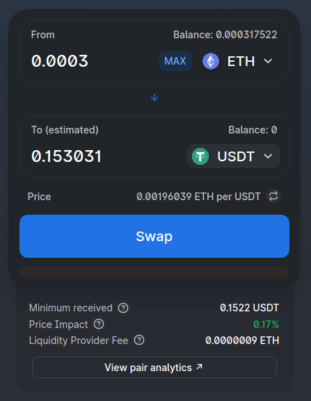
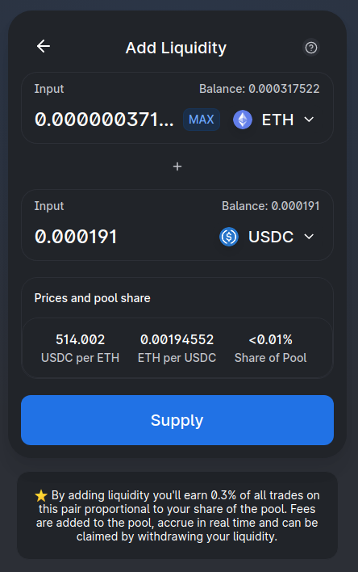
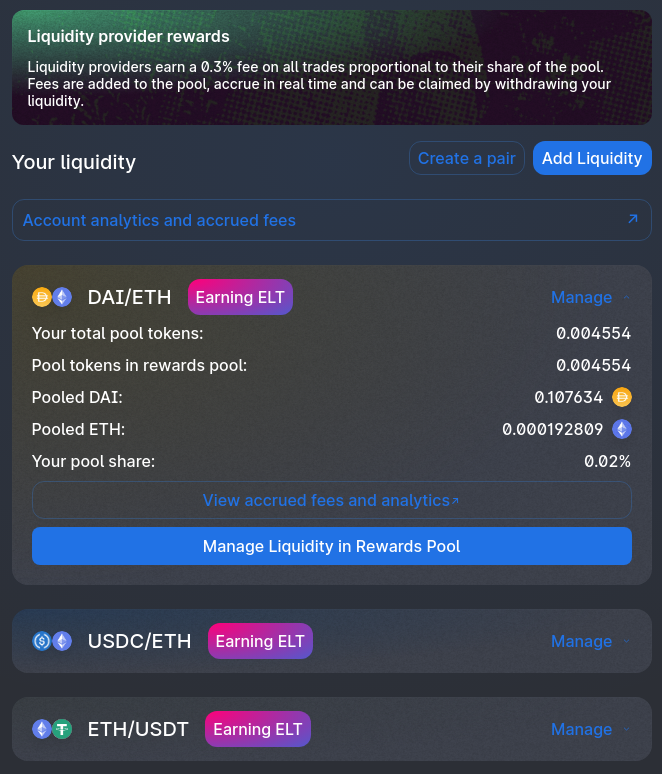
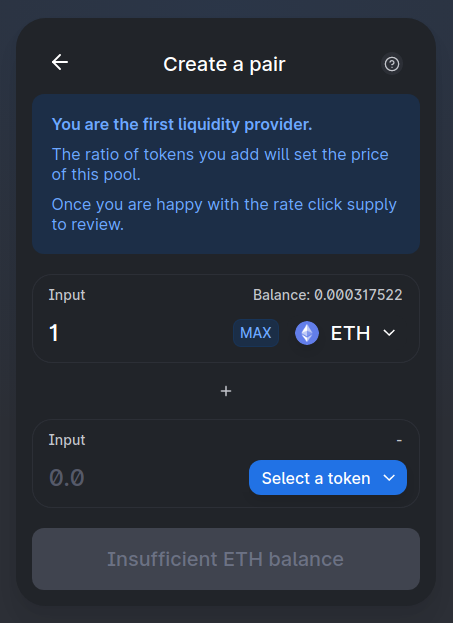
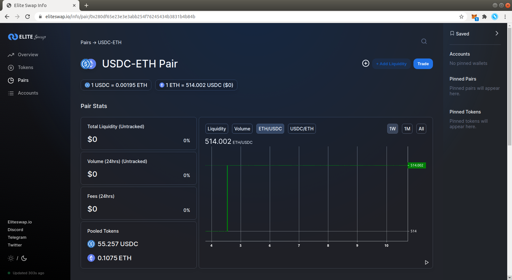

Elite Swap has been [deployed to the Ethereum mainnet](https://etherscan.io/address/0x81c27D1A0a6413c6A6d6d8e54B0A9C869d16771C#code)!

Today, the following open source projects are being released:

- An [interface](https://eliteswap.io/) for swapping and liquidity provision on Elite Swap
- An [info site](https://eliteswap.io/info/) for Elite Swap analytics

## Interface

The open source [interface](https://eliteswap.io/) supports creating and providing liquidity in ERC20 / ERC20 pairs, such as DAI/USDC.

While Elite Swap uses WETH, this is abstracted in the interface and ETH can be used directly.

#### Swapping

#### Liquidity Provision

#### Liquidity Manage

#### Pair Creation

## Info Site

Elite Swap analytics are available at [eliteswap.io/info](https://eliteswap.io/info/), built on top of the open source [Elite Swap subgraph](https://github.com/EthereumEliteswap/eliteswap-subgraph).

## All other questions

For all questions, you can join and engage with the community in the [Elite Swap Discord](https://discord.gg/yFsjhuQ7Kj).
