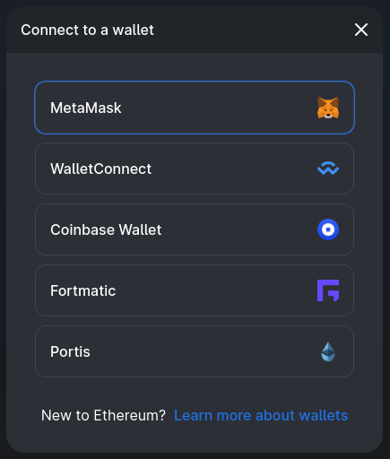
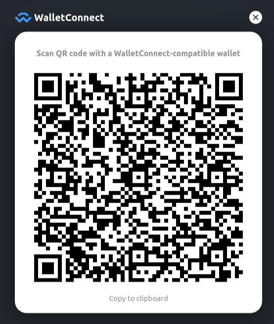

Added wallet support for:

- [MetaMask](https://metamask.io/)

- [WalletConnect](https://walletconnect.org/)

- [WalletLink](https://www.walletlink.org/) (Coinbase Wallet)

- [Fortmatic](https://fortmatic.com/)

- [Portis](https://www.portis.io/)

You can also dynamically switch between wallets through the account modal, which is opened by clicking on your account at the top-right hand of the screen.

# MetaMask

Elite Swap easy connect to MetaMask. If payment is required, a pop-up window will appear asking to confirm the transaction from the MetaMask account.

# WalletConnect

WalletConnect allows mobile wallets to connect to your desktop browser through a QR code and sign transactions. It even works on browsers such as Safari!

# WalletLink

WalletLink functions similar to WalletConnect, using a QR code to connect your mobile Coinbase Wallet to any browser. It only needs to be linked once to work across all dApps that support it.

# Portis

Portis allows users to sign into their wallet with a username / password combination in a pop-up window. They support 2FA and provide a fiat on-ramp through Wyre.

# Fortmatic

Fortmatic allows users to sign into their wallet through traditional methods like email and phone in a pop-up window. They support 2FA and allow custom styling for sites that integrate.

# web3-react@6

This is all built on the new v6.0 release of the [web3-react library](https://github.com/NoahZinsmeister/web3-react) built by [Noah Zinsmeister](https://twitter.com/NoahZinsmeister). This release features many improvements including improved connector logic and a monorepo with dynamic imports to get your bundle sizes down. This enables us to provide great UX for seamlessly switching between wallet providers.
