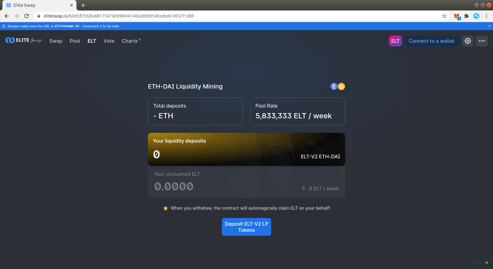
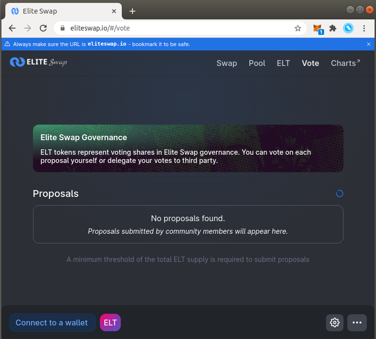

- ELT, the Elite Swap Protocol token, is live!

- ELT contract address: [0x380291A9A8593B39f123cF39cc1cc47463330b1F](https://etherscan.io/token/0x380291A9A8593B39f123cF39cc1cc47463330b1F)

- 60% of the ELT genesis supply is allocated to Elite Swap community members

- To start, ELT is available through four liquidity mining pools

**ELT Allocation**

10 billion ELT have been minted at genesis and will become accessible over the course of 4 years. The initial four year allocation is as follows:

- 60.00% to Elite Swap community members `6,000,000,000 ELT`

- 20% to team members, future employees and advisor with 4-year vesting `2,000,000,000 ELT`

- 10% to investors with 4-year vesting `1,000,000,000 ELT`

- 10% to airdrop `1,000,000,000 ELT`

**Community Treasury**

The governance treasury will retain 58% [5,800,000,000 ELT] of ELT supply to distribute on an ongoing basis through **contributor grants, community initiatives, liquidity mining**, and other programs.

ELT will vest to the governance treasury on a continuous basis according to the following schedule. Governance will have access to vested ELT starting December 16 2020 12:00am UTC.

| **Year** | **Community Treasury** | **Distribution %** |
| -------- | ---------------------- | ------------------ |
| Year 1   | 2,400,000,000 ELT      | 24%                |
| Year 2   | 1,700,000,000 ELT      | 17%                |
| Year 3   | 1,100,000,000 ELT      | 11%                |
| Year 4   | 600,000,000 ELT        | 6%                 |

Team, investor, and advisor ELT allocations will have tokens locked up on an identical schedule.

**Liquidity Mining**

An initial liquidity mining program will go live November 16 2020 12:00am UTC. The initial program will run until January 18 2021 10:40am UTC and target the following four pools on Elite Swap:

- ETH/USDT

- ETH/USDC

- ETH/DAI

- ETH/WBTC

50,000,000 ELT will be allocated per pool to LPs proportional to liquidity, which roughly translates to 833,333 ELT per pool per day.

These ELT are not subject to vesting or lock up.

After 30 days, governance will reach its vesting cliff and Elite Swap governance will control all ELT vested to the Elite Swap treasury. At this point, governance can vote to allocate ELT towards grants, strategic partnerships, governance initiatives, additional liquidity mining pools, and other programs.

**Governance assets**

A community-managed treasury opens up a world of infinite possibilities. We hope to see a variety of experimentation, including ecosystem grants and public goods funding, both of which can foster additional Elite Swap ecosystem growth.

Elite Swap governance will be live from day one, although control over the treasury will be delayed until December 16 2020 12:00am UTC. Control over the Elite Swap fee switch is subject to a 180 day time lockdelay.

These grace periods provide the Elite Swap community enough time to familiarize itself with the governance system, bring in **a diverse and high-quality set of protocol delegates,** and begin discussions and communications around potential governance proposals.

ELT holders are responsible for ensuring that governance decisions are made in compliance with applicable laws and regulations. To help facilitate this, the fee switch has been initialized to a contract ELT holders can use to vote on tokens for which they will collect fees. The community is encouraged to consult knowledgeable legal and regulatory professionals before implementing any specific proposal.

In the meantime, ELT holders will have immediate ownership of:

- Elite Swap governance

- ELT community treasury

- The protocol fee switch

- Elite Swap Default List

Initial governance parameters are as follows:

- 1% of ELT total supply (delegated) to submit a governance proposal

- 4% of ELT supply required to vote &#39;yes&#39; to reach quorum

- 7 day voting period

- 2 day timelock delay on execution

**Next steps**

Liquidity providers in the preliminary set of targeted pools can [deposit](https://eliteswap.io/#/elt) their liquidity tokens. Mining began on November 16th 2020 12am UTC.

ELT tokens can be delegated and used to vote through the [governance portal](https://eliteswap.io/#/vote).

**Contracts**

ELT Token:

[https://etherscan.io/token/0x380291a9a8593b39f123cf39cc1cc47463330b1f](https://etherscan.io/token/0x380291a9a8593b39f123cf39cc1cc47463330b1f)

Liquidity mining:

[Tether Liquidity Mining Pool](https://etherscan.io/address/0xBF2B5Be71Bc353906618A0BeF413F9c2E33f6dd4)

[USDC Mining Pool](https://etherscan.io/address/0x1469f6cE0A7F82FF6403730f21714DC083d611a3)

[DAI Mining Pool](https://etherscan.io/address/0x6aa11da7ecA4f8f2F66BEFDd11b7C697606d913e)

[WBTC Mining Pool](https://etherscan.io/address/0xad064270150db970E3a10d0f492CAa87CAE678E1)

Governance:

[https://etherscan.io/address/0x1E3776A7Bb9228E997806FA6Faf455B0bd4d77cc](https://etherscan.io/address/0x1E3776A7Bb9228E997806FA6Faf455B0bd4d77cc)

Timelock:

[https://etherscan.io/address/0x3Ce6feac2DC11a8799dC2a4B9434c5943E1c69EE](https://etherscan.io/address/0x3Ce6feac2DC11a8799dC2a4B9434c5943E1c69EE)
